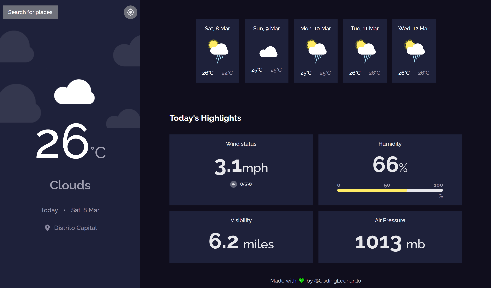

# Weather App

## Table of contents

- [Overview](#overview)
  - [The challenge](#the-challenge)
  - [Screenshot](#screenshot)
  - [Links](#links)
- [My process](#my-process)
  - [Built with](#built-with)
  - [Useful resources](#useful-resources)
- [Author](#author)

## Overview

### The challenge

This programming challenge consists of developing a web or mobile application that allows users to check the current weather and the forecast for the next 5 days. The application must be able to detect the user's location to display the weather for their city by default, but it must also allow searching for the weather for any other city. The interface must display detailed information such as date and location, type of weather with its respective image, minimum and maximum temperatures, wind state and direction, humidity percentage, visibility and air pressure. Optional functionalities may include the ability to request the weather for the user's current location and convert the temperature between degrees Celsius and Fahrenheit.

### Screenshot

### Links

- [Live Site URL](https://codingleonardo.github.io/weather-app/)

## My process

### Built with

- [Typescript](https://www.typescriptlang.org/) - Superset of JavaScript which adds static typing
- [React](https://reactjs.org/) - JS library
- [Tailwind CSS](https://tailwindcss.com/) - CSS library
- [OpenWeatherMap](https://openweathermap.org/) - An API for weather data and weather forecasts
- [The Companies API - Cities](https://www.thecompaniesapi.com/es/api/search-cities) - A data api of world cities
- [FlagAPI](https://flagsapi.com/) - An API of images of all the flags of the world

### Useful resources

- [MDN Web Docs](https://developer.mozilla.org/en-US/docs/Web/CSS) - This helped me learn how filters work in css.

## Author

- Website - [Leonardo Rivero](https://codingleonardo.github.io/)
- DevChallenges.io - [@CodingLeonardo](https://devchallenges.io/profile/8c0bdef8-0f64-4c92-8640-bcae8d05fb4b)
- Twitter - [@CodingLeonardo](https://www.twitter.com/CodingLeonardo)
